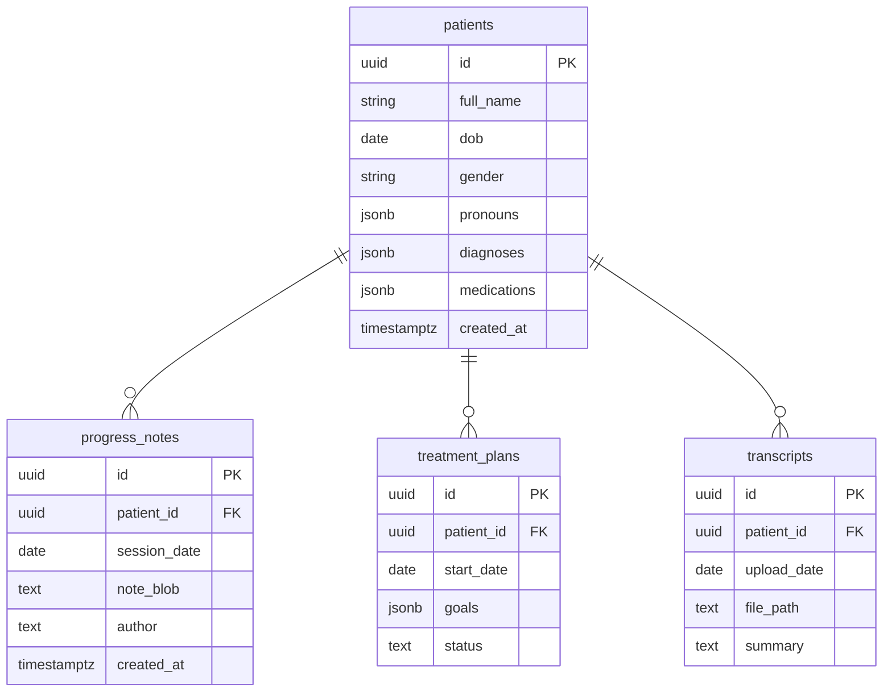

# Product Requirements Document  
**Project:** *AI-First Behavioral-Health EHR (working title)*  
**Owner:** Adi Tiwari, VP Operations, Opus Behavioral Health  
**Date:** April 30 2025  
**Version:** 0.9-draft  

---

## 1  Executive summary
We will deliver the first EHR built “chat-first.” Providers can open any client chart and:  

* Ask natural-language questions (“When did we last adjust meds?”)  
* Dictate two sentences → receive a fully drafted SOAP progress note  
* Generate a treatment plan in minutes via an AI-guided wizard  
* Upload a session transcript and store/search it seamlessly  

The MVP limits scope to mental-health outpatient practices (solo ↔ 15 clinicians) and leaves out scheduling, billing, HIPAA hardening, and outcomes tracking. Our North-Star metric: **“Providers complete a clinically compliant note in < 90 seconds.”**

---

## 2  Problem statement
1. Writing progress notes is the #1 non-reimbursable time sink for therapists and NPs.  
2. Navigating legacy EHR UIs compounds the burden (dozens of clicks, modal windows, rigid templates).  
3. Existing “AI note” add-ons bolt atop old EMRs, forcing context-switching and doubling cost.  

**Opportunity:** a true AI-native chart that *starts* with free-form language and stores structured data secondarily.

---

## 3  Goals & non-goals

| Goal (MVP) | Metric / acceptance | Non-goal (phase-later) |
|------------|--------------------|------------------------|
| **G1** – Draft SOAP note from 2-line summary | ≥90 % of beta testers classify note as “needs minor edits or less” | Automated billing-code mapping |
| **G2** – Chat answers from chart | Median response time ≤5 s | LLM “care-plan coaching” |
| **G3** – AI-guided treatment plan | Wizard completion ≤5 min | Outcomes libraries, signatures |
| **G4** – Store & view transcripts | Upload ≤50 MB file in <10 s; searchable summary visible | Speaker diarization, redaction |
| **G5** – Delightful UX | SUS ≥80 after 2 weeks use | Mobile app |
| **G6** – Demo readiness in 5 weeks | Click-through demo with dummy data | HIPAA compliance audit |

---

## 4  Success metrics (MVP)

| Metric | Target | Instrumentation |
|--------|--------|-----------------|
| Avg. note-completion time | ≤90 s | Client-side timer, DB log |
| % notes accepted w/o re-draft | ≥70 % | In-app feedback button |
| Daily active providers / invited | ≥60 % | Auth logs |
| NPS (post-demo) | ≥40 | Survey |
| Crash-free sessions | ≥99.5 % | Sentry |

---

## 5  Personas

| Persona | Pain-points | Key value promise |
|---------|------------|-------------------|
| **Dr. Anna (Psychiatrist, solo)** | 20 min daily on SOAPs; hates EHR clicks | “Finish notes during session; reclaim evenings.” |
| **Carlos (LCSW, group practice)** | Tracks dozens of clients; loses time finding med changes | “Ask your chart anything—instant recall.” |
| **Practice owner (non-clinical)** | Onboards new clinicians; dislikes paying for unused features | “Start free, add billing later—modular cost.” |

---

## 6  User-journey map (happy path)

1. **Login** (hard-coded or Clerk)  
2. **Clients list** → search “Jamie B.”  
3. **Open chart tab**  
4. Top bar shows demographics; click **Chat with Chart**  
5. Ask: “When did Jamie’s PHQ-9 improve?” → response in 3 s  
6. Click **New note** → type “Session focused on CBT reframing.” → **Generate SOAP**  
7. Review/edit → **Save**  
8. Navigate to **Treatment Plan** → AI suggests goals → accept & save  

---

## 7  Scope

### 7.1 Functional requirements

| ID | Requirement | Priority |
|----|-------------|----------|
| **F-1** | CRUD patients with demographics, diagnosis list, meds list | Must |
| **F-2** | Progress-note generator (SOAP) from free text | Must |
| **F-3** | Treatment-plan wizard with AI suggestions | Must |
| **F-4** | Chat interface tied to patient context | Must |
| **F-5** | Upload session transcript; store + summarise | Should |
| **F-6** | Basic auth / single provider roles | Must |
| **F-7** | Demo seed script to populate 10 dummy patients | Must |

### 7.2 Non-functional

| Category | Requirement |
|----------|-------------|
| **Performance** | 95-percentile API latency ≤250 ms (ex-LLM); LLM roundtrip ≤6 s |
| **Security (MVP)** | HTTPS only; env-vars for keys; no PHI outside internal testers |
| **Accessibility** | WCAG 2.1 AA for core flows |
| **Reliability** | Crash-free sessions ≥99.5 % |
| **Scalability** | Design to shard by tenant later; single-tenant OK now |

---

## 8  Data design (initial schema)

---

## 9  Technical architecture

* **Frontend**: Next.js 14 App Router, shadcn/ui, Tailwind  
* **API layer**: Next.js route handlers (tRPC optional)  
* **ORM / DB**: Prisma ↔ Postgres (Supabase dev hosting)  
* **LLM**: OpenAI gpt-4o (chat-completions)  
  * Context composer: latest 3 notes + demographics + meds; naive string chunking  
* **File storage**: Supabase Storage bucket  
* **Auth (MVP)**: Clerk or Supabase Auth single-tenant disable invite flow  
* **DevOps**: Vercel preview → Railway prod; Terraform later  

---

## 10  Roadmap & milestones

| Sprint (1 wk) | Deliverable | Owner |
|---------------|-------------|-------|
| **0** Boot | Repo scaffold, CI, Prisma schema | Dev |
| **1** Patients CRUD + grid UX | Dev / Design |
| **2** Progress-note AI flow | Dev |
| **3** Treatment-plan wizard | Dev |
| **4** Chat with chart | Dev |
| **5** Transcripts upload & summary; demo polish | Dev + PM |
| **6** 10-provider closed beta, collect metrics | PM |

---

## 11  Launch & rollout

1. **Internal alpha** – Opus team (5 users)  
2. **Design partner beta** – 5 solo therapists, NDA (no PHI)  
3. **Feedback sprint** – Triage bugs, refine prompts  
4. **Conference demo** – Seattle substance-abuse conference (target July 2025)  

Success = secure 3 LOIs or paid pilot agreements.

---

## 12  Risks & mitigations

| Risk | Probability | Impact | Mitigation |
|------|-------------|--------|------------|
| OpenAI latency spikes | Med | Med | Cache embeddings; graceful spinner |
| Scope creep (billing / scheduling) | High | High | Enforce PRD boundaries; maintain parking-lot |
| HIPAA blockers post-MVP | Med | High | Engage compliance advisor in parallel |
| Note quality below clinician standard | Med | High | Human-in-the-loop editing; collect feedback quick |

---

## 13  Open questions

1. Brand name? (merge into Opus vs. stand-alone)  
2. Dictation tech choice post-MVP (AssemblyAI vs. native browser)  
3. Will diagnosis & meds stay as free-text in v1 or require structured pick-lists?  
4. Pricing model hypothesis for pilot (per-provider vs. per-note credits)  

---

## 14  Appendices

* **A. Prompt templates (v0.1)** – stored in `/prompts/` folder.  
* **B. Demo data seed script** – `/scripts/seed.ts`.  
* **C. Compliance gap list (to address after validation).**

---

### 🚀  Next action checklist (owner in parentheses)

- [ ] Approve PRD scope & metrics (Adi, CEO)  
- [ ] Finalise tech stack choices (Lead Dev)  
- [ ] Create Jira board & sprint 0 tasks (PM)  
- [ ] Schedule weekly demo review (All)

*Once this PRD is signed off, sprint 0 begins immediately.*